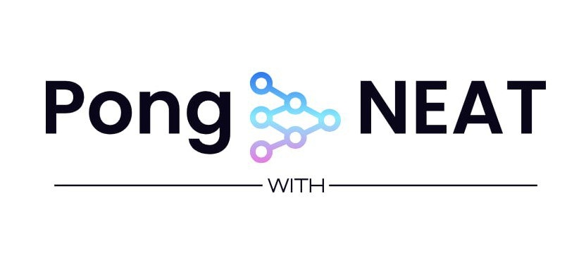
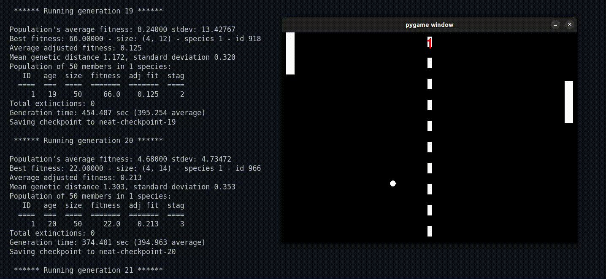

# AI Pong with NEAT



## Description
### Overview
We all have played the famous Pong game at least once before. This project integrates the game with AI, where a neural network learns to play Pong by playing against itself multiple times. Instead of a single neural network, numerous networks are trained in each generation. These networks compete and earn a score (called fitness), and the best ones merge to create better networks, similar to natural selection.

### What is NEAT?
NEAT (NeuroEvolution of Augmenting Topologies) is a genetic algorithm designed to evolve neural networks. It uses evolutionary principles such as mutation, crossover, and selection to optimize neural networks. NEAT is effective in evolving both the weights and the structures of the networks, enabling complex and efficient network topologies to be discovered over generations. Read [NEAT documentation](https://neat-python.readthedocs.io/en/latest/neat_overview.html) for further understanding.

### Training
At the start of training, a neural network is created based on given configurations, forming a population of networks as the first generation. Each generation calculates the fitness value (number of times the ball hits the paddle) for each genome (neural network) by playing against all other genomes. The best genomes merge (crossover) to create new genomes for the next generation. This process continues until the fitness threshold or the maximum number of generations is reached. The best genome is saved using the Python pickle module.



### Testing
After training, the best genome is stored, and a human player can test their performance against this AI. This allows users to see how well the AI has learned to play Pong and have fun playing with it.


## Installation
To install the necessary packages, use the requirements.txt file:
```bash
pip install -r requirements.txt
```

## Usage
1. **Configuration:** Modify the settings in the config.txt file as needed. This file is based on the NEAT documentation and customized for this game. For more details on configuration, check the [NEAT documentation](https://neat-python.readthedocs.io/en/latest/config_file.html) about the configuration file.

2. **Main Actions:** There are two primary actions you can perform:

- **Train the AI:** Add the `train` argument while running the `main.py`. If you'd like to train the model from a specific checkpoint, you can just add the checkpoint as the second argument. Use the commands below:
```bash
python main.py train
python main.py train neat-checkpoint-9
```
- **Test the AI:** Just like before, Add the `test` argument while running the `main.py`.
```bash
python main.py test
```

## Technologies Used
- Python
- Pygame
- NEAT
- Pickle (built-in Python module)

## Contributing
I am open to contributions, feel free to play with the code and make it better ;).


## License
This project is licensed under the MIT License. See the LICENSE file for details.

## Contact Information
Feel free to reach out via the following platforms:

[](https://www.hopp.bio/mehdirt)
[](mailto:mahdirafati680@gmail.com)
[](https://www.linkedin.com/in/mahdi-rafati-97420a197/)
[](https://medium.com/@mehdirt)
[](https://www.kaggle.com/mahdirafati)
[](https://x.com/itsmehdirt)
